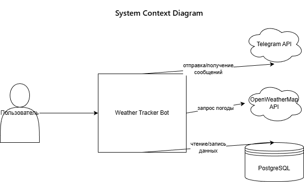
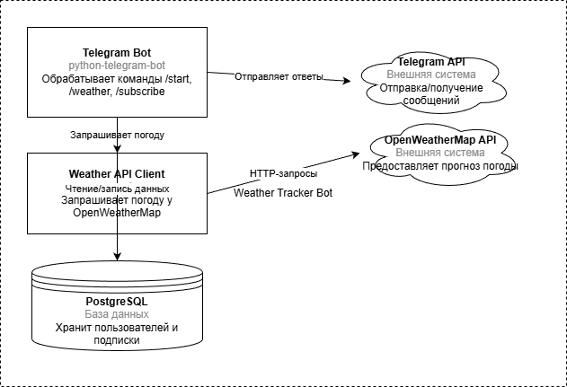
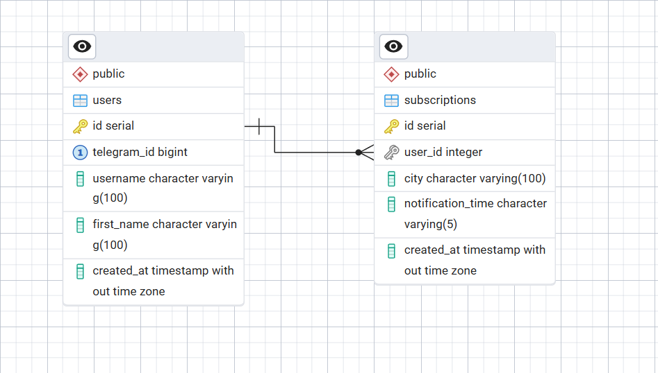

# Weather Tracker Bot

Telegram bot for weather tracking with personal settings.

## Team
- Роза Якшиева, группа 5130904/30104
- Лопатина Софья, группа 5130904/30104
- Воробьева Алена, группа 5130904/30104

## Technology Stack
- Python + FastAPI
- PostgreSQL
- Telegram Bot
- OpenWeatherMap API

## Problem Definition

Пользователям неудобно получать актуальную погоду: нужно каждый раз вводить город, нет единого места для прогноза и уведомлений. Существующие Telegram-боты часто не поддерживают сохранение настроек или отправку автоматических уведомлений по расписанию.

## Development of Requirements

- Как пользователь, я хочу отправить `/weather Москва` или просто написать «Москва» и получить текущий прогноз.
- Как пользователь, я хочу видеть список своих подписок (`/mysubs`) и удалять их (`/unsubscribe <ID>`).
- Как пользователь, я хочу получить прогноз на 5 дней (`/forecast Лондон`).

## Estimating the Number of Users

- Целевая аудитория: частные пользователи Telegram.
- Предполагается, что им пользуется порядка **10 000 пользователей**.
- Среднее число подписок на пользователя: **1–2** → до **15 000 уведомлений в сутки**.

## Estimating the Data Retention Period

- Данные пользователя (`users`) и подписки (`subscriptions`) хранятся бессрочно, пока пользователь не удалит Telegram-аккаунт или не отменит подписку.
- Данные неактивных пользователей (>2 лет без взаимодействия) могут быть удалены.
- Прогнозы кэшируются в памяти только на время обработки запроса.

## Architecture Development and Detailed Design

### Service Load

При 10 000 пользователях ежедневная нагрузка:
- ~2 000 ручных запросов
- 10 000 –15 000 автоматических уведомлений

Итого: **12 000 –17 000 запросов/сутки** → **~0.2 RPS** в среднем.

### Read/Write Correlation

- **Read (85%)**: запросы погоды, чтение подписок → **~0.17 RPS**
- **Write (15%)**: регистрация пользователя, управление подписками → **~0.03 RPS**

### External API Load

- Каждый запрос к боту = 1 вызов OpenWeatherMap API.
- При 17 000 запросов/сутки → **17 000 вызовов в день**.
- OpenWeatherMap Free Plan: **1 000 000 вызовов/месяц**.

### Notification System

- Механизм: `JobQueue.run_repeating(..., interval=60)`
- Каждую минуту проверяются подписки с `notification_time = HH:MM`.
- Отправка уведомлений — последовательная с задержкой **0.5 с** между сообщениями → избегает Telegram rate limits.

### Traffic Volumes

- Исходящее сообщение: **~1 КБ**
- Суточный исходящий трафик: **17 000 × 1 КБ ≈ 17 МБ**
- Входящий трафик: **< 1 МБ/сутки**

### Disk System Capacity

- `users`: ~200 Б/запись → 10 000 × 200 Б = **2 МБ**
- `subscriptions`: ~150 Б/запись → 15 000 × 150 Б = **2.25 МБ**
- С индексами и служебными данными: **< 20 МБ**

### Diagrams




### API

Weather Tracker Bot не предоставляет REST API для внешних клиентов. Весь интерфейс взаимодействия реализован через Telegram-чат.

- Модуль `handlers.py` выступает в роли входной точки для всех пользовательских команд (`/start`, `/weather` и т.д.).
- Модуль `notifier.py` реализует внутренний планировщик, который каждую минуту проверяет подписки и инициирует отправку уведомлений через Telegram API.
- Модуль `api/weather.py` предоставляет единый интерфейс к OpenWeatherMap API.
- Модуль `database/db.py` выступает в роли DAL, инкапсулируя все операции с PostgreSQL.

Доступ к боту возможен только через Telegram — внешних HTTP-эндпоинтов нет.

### Database




Основные сущности (`users`, `subscriptions`) вынесены в отдельные таблицы. Связь между ними реализована через целочисленный внешний ключ (`user_id → users.id`).  

На ключевых полях (`telegram_id`, `id`) автоматически создаются **B-tree индексы** благодаря ограничениям `PRIMARY KEY` и `UNIQUE`.  

Типичные запросы выполняются через **index scan** или небольшой **seq scan** и занимают **менее 2 мс** даже при десятках тысяч записей.  

Агрегированные данные не кэшируются, так как прогноз погоды всегда запрашивается в реальном времени. Это упрощает схему и исключает необходимость поддержки актуальности агрегатов.

### Scaling Up the Service

Исходно система рассчитана на **10 000 активных пользователей**. При росте до **100 000** сохраняются требования по времени отклика (прогноз за **< 2 с**, уведомления — без задержек).

#### Масштабирование БД

- PostgreSQL масштабируется вертикально (увеличение CPU/RAM).
- При необходимости добавляются **read replica** для операций чтения.
- Партиционирование не требуется (объём данных мал).


## Сборка и запуск

> **Требования**: установленные **Docker** и **docker-compose**.
# 1. Сборка проекта
```bash
docker-compose build
```
# 2. Unit-тесты
```bash
docker-compose run --rm bot pytest tests/unit
```

# 3. Интеграционные тесты
```bash
docker-compose run --rm bot pytest tests/integration
```
# 4. Запуск приложения
```bash
docker-compose up bot
```
